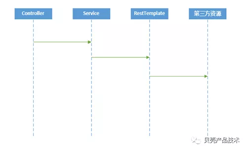
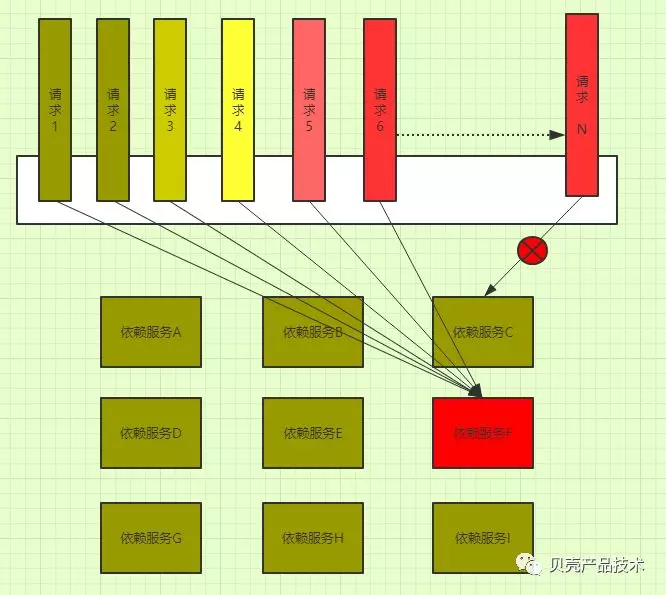
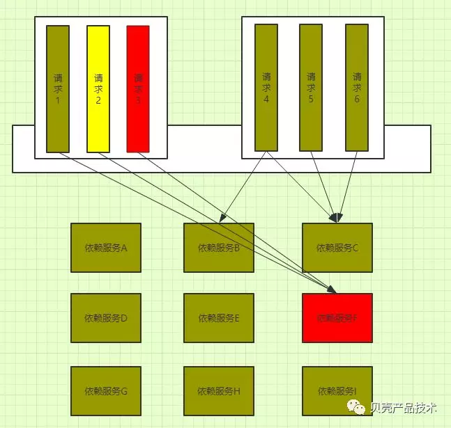

## Hystrix在项目中实践

原创 王大可 [贝壳产品技术](javascript:void(0);) *2019-03-07*

作者王大可（企业代号名），贝壳找房后端研发工程师。

# 1背景

我们的业务通常会大量依赖于第三方提供的服务，这些服务都是基于Http请求，然后依赖方的服务能力又是参次不齐的，因此，第三方资源的稳定性会直接影响着我们系统的稳定性。简单的调用模式如图1表示：

图1 调用关系时序图

当某一个依赖的外部服务发生了异常，如果外部服务可以快速失败这到还好，最怕的就是服务响应变慢。可以试想一下，一个http请求过去，对方的服务一直在慢慢的进行处理，一直到我们所设置的http处理时间达到我们所设置的超时上限。在这个过程当中，很有可能会因为某一个外部资源响应速度变慢，而会长时间占用我们的http连接池，导致其他可以正常提供服务的资源也无法正常运行，严重的情况下甚至会产生雪崩效应。

如图2所示：当依赖的服务F发生了严重超时的情况时，所有与服务F相关的请求都会堵塞在这里。当后续第N个请求来的时候，即使与服务F没有依赖关系，但由于前面的请求把资源都占用了，所有其仍然拿不到资源，无法调用外部服务。

图2 资源耗尽 无法响应


# 2为什么引入Hystrix

Hystrix是用于分布式场景下服务熔断、降级的开源Java库。它的主要作用有线程隔离，熔断，降级和监控报警。这里不会过多的介绍Hystrix本身的概念及定义，具体内容可以看其github网站或是自行搜索，会有大量的仔细介绍。

根据自身业务的具体情况，把外部依赖进行隔离，从而保证某些外部服务出现问题时，其它的服务仍然是可用并且是不受影响的。

如图3所示：服务F发生异常，导致请求3无法处理请求，但是请求4、5、6仍然可以继续对外提供服务。

图3 线程池隔离


# 3模拟不引入Hystrix时

当模拟不引入Hystrix时，线程耗尽的情况：

- 模拟应用调用第三方服务（第三方是我们模拟的一个10秒睡眠的服务）

```Java
1  /**
2   * controller层
3   * @param sleep 睡眠时间，模拟第三方业务的处理时间。
4   */
5  @RequestMapping(value = "hystrixTest")
6  public ApiResult<String> hystrixTest(@RequestParam("sleep") int sleep){
7          ApiResult<String> apiResult =iHystrixService.execute();
8          return apiResult;
9   }
 1  /**
 2   *service层
 3   *service层中调用的/hystrix/sleep地址，就是我们模拟的第三方服务。
 4   *@param sleep 睡眠时间，模拟第三方业务的处理时间。
 5   *hystrix/sleep地址只是根据传过来的sleep参数进行Thread.sleep()操作。
 6   */
 7  public ApiResult<String> execute(int sleep) {
 8    try{
 9      System.out.println("开始业务处理 调用Http"
10             + FastDateFormat.getInstance("yyyy-MM-dd HH:mm:ss")
11             .format(new Date()));
12
13       // 模拟调用外部服务 逻辑仅是进行Tread.sleep操作模拟处理时间
14       ResponseEntity<String> responseEntity = restTemplate
15                      .getForEntity("http://127.0.0.1:8080/hystrix/sleep?sleep="
16                  +sleep,String.class);
17
18       System.out.println("调用Http完成 satusCode:"
19             +responseEntity.getStatusCode()+" "
20             + FastDateFormat.getInstance("yyyy-MM-dd HH:mm:ss")
21             .format(new Date()));
22
23       return ApiResult.SUCCESS();
24    }
25    catch (Exception e){
26      return ApiResult.FAILED();
27    }
28}
```


- 配置线程池数量（这里配置成5个）

```xml
 1  <!-- 连接池管理器 HttpClient是线程安全的 且可同时执行多个线程的请求 
 2       管理持久的http连接 节省创建连接时间 -->
 3  <!-- 维护的连接数在每个路由基础和总数上都有限制 -->
 4  <bean id="pollingConnectionManager" class="org.apache.http.impl.conn
 5                                  .PoolingHttpClientConnectionManager">
 6        <!-- 最大连接数 -->
 7        <property name="maxTotal" value="5"/>
 8        <!-- 每个路由基础的连接 -->
 9        <property name="defaultMaxPerRoute" value="5"/>
10  </bean>
```


- 模拟客户端服务调用（这里用的是6个）

我们模拟6个并发调用controller，也就会发起6次服务调用，由于我们用sleep简单模拟的第三方服务，因此在我们发起第6次controller请求时，前面的5个请求均没有处理完毕返回结果，所以第6次的请求会因为拿不到http的连接无法调用hystrix/sleep这个模拟服务的地址。
从图3中我们也可以看出来，有5个请求因为拿到了http连接资源，可以正常访问外部服务，而有一个则因为当时http连接已被耗尽，则不能继续访问第三方服务。日志如图4所示：

图4 有1个请求拿不到http连接资源

我们可以试想这样一种场景，刚刚6个请求，其对应的是A，B两个外部服务。假如A服务由于某种情况发生响应变慢，而B仍然能良好的提供服务，在这种情况下，就会发生由于A服务发生问题，而恰巧依赖A服务的外部接口又有大量请求，此时就会使得业务系统的资源全部被A服务占用，这样业务系统中与A服务无关的业务，也无法拿到资源去访问服务良好的B服务，最坏的情况就是业务系统中的一台机器被耗尽无法对外提供服务而down倒，由于负载均衡或是服务发现的机制，接下来所有的请求又会打到另外的机器上，一直到所有机器都被打爆，发生雪崩效应。
所以我们需要一种机制能够隔离坏的资源，让正常的资源提供正常的服务。这里我们就用到了上面说到的Hystrix。
本文会介绍hystrix的两种使用方式，命令行编码和注解方式。

##  

# 4Hystrix的引用

- 引入maven依赖

```xml
 1  <hystrix.core.version>1.5.12</hystrix.core.version>
 2  <hystrix.javanica.version>1.5.12</hystrix.javanica.version>
 3  <hystrix.metrics.version>1.5.12</hystrix.metrics.version>
 4  <dependency>
 5      <groupId>com.netflix.hystrix</groupId>
 6      <artifactId>hystrix-core</artifactId>
 7      <version>${hystrix.core.version}</version>
 8  </dependency>
 9  <dependency>
10      <groupId>com.netflix.hystrix</groupId>
11      <artifactId>hystrix-metrics-event-stream</artifactId>
12      <version>${hystrix.metrics.version}</version>
13   </dependency>
14   <dependency>
15       <groupId>com.netflix.hystrix</groupId>
16       <artifactId>hystrix-javanica</artifactId>
17       <version>${hystrix.javanica.version}</version>
18   </dependency>
```

##  

# 5注解方式使用Hystrix

**5.1 线程池隔离**

业务层增加 @HystrixCommand注解：

```java
 1  @HystrixCommand(groupKey = "HystrixServiceImpl", // groupKey 该命令属于哪个组
 2              commandKey = "execute", // 该命令的名称
 3              threadPoolKey = "HystrixServiceImpl", // 该命令所属线程池的名称,默认同groupKey
 4              fallbackMethod = "executeFallback", // 服务降级方法
 5              commandProperties = {
 6              @HystrixProperty(name = "execution.isolation.strategy",
 7                                                   value = "THREAD"), // 线程池方式
 8              @HystrixProperty(name = "execution.isolation.thread.timeoutInMilliseconds",
 9                                                    value = "5000")   // 超时时间为5秒
10  })
11  public ApiResult<String> execute() {
12     try{
13          System.out.println("开始业务处理 调用Http"
14                + FastDateFormat.getInstance("yyyy-MM-dd HH:mm:ss")
15                  .format(new Date()));
16
17          ResponseEntity<String> responseEntity = restTemplate
18                  .getForEntity("http://127.0.0.1:8080/hystrix/sleep",String.class);
19
20          System.out.println("调用Http完成 satusCode:"
21                + responseEntity.getStatusCode()+" "
22                + FastDateFormat.getInstance("yyyy-MM-dd HH:mm:ss")
23                  .format(new Date()));
24
25          return ApiResult.SUCCESS();
26      }
27      catch (Exception e){
28          return ApiResult.FAILED();
29      }
30  }
```


- 增加回退方法

```java
1  public ApiResult<String> executeFallback() {
2       System.out.println(Thread.currentThread().getId()
3              + " "+Thread.currentThread().getName()+" "
4              + Thread.currentThread().getState().toString());
5
6      return ApiResult.FAILED("hystrix->executeFallback");
7  }
```


- 模拟超时

模拟第三方执行时间为10S，而我们在Hystrix中设置的为5S，所以会触发服务降级，应用在超时后执行executeFallback降级方法。如图5所示：

图5 服务超时降级

细心点的人可以看出来，虽然客户端返回以及服务端执行了服务降级方法，但是原有的处理逻辑仍然继续执行，对于降级的请求，原有本身处理过程不会被中断。当服务降级到达一定的阀值时会启动断路器，后续一段时间内的请求都将进入降级方法，不会再调用业务逻辑。


- 使用Hystrix进行线程隔离

新增加一个外部模拟服务B，用于模拟访问不同的外部依赖， 分别设置其线程池大小为2个大小。

```java
 1  @HystrixCommand(groupKey = "HystrixServiceImpl",commandKey = "execute",
 2        fallbackMethod = "executeFallback",
 3        commandProperties = {
 4        @HystrixProperty(name = "execution.isolation.strategy",value = "THREAD"),
 5        @HystrixProperty(name = "execution.isolation.thread.timeoutInMilliseconds",
 6                         value = "5000")
 7        },
 8        threadPoolProperties = {
 9        @HystrixProperty(name = "coreSize",value = "2"),// 线程池大小
10        @HystrixProperty(name = "maQueueSize",value = "-1")// -1 表示不等待直接拒绝
11  })
```


- 模拟4个客户端访问系统资源，其中3个访问A资源1个访问B资源。如图6所示：

图6 4个客户端请求AB两个资源

从日志可以看出，访问A资源的3个客户端，有2个成功，1个返回fallback结果，这是因为我们设置的Hystrix的线程池大小为2，所以第三个请求来的时候获取不到可用的线程池资源。而总的restTemplate线程池之前设置的为5，此时仍有连接资源，所以B资源可以继续访问，而A由于业务处理的慢则没有连接返回释放资源，所以A的后继请求都是失败。
通过这种方式，可以起到线程隔离的效果，但是当所有的线程隔离池中当前所使用的总线程数大于了我们设置的http连接总数，总体业务当然还是失败的。Hystrix只是起到了线程池资源隔离的作用，所以具体每个线程池设置多大的参数，还是要经过开发人员线上真实情况动态调整。

###  

### **5.2 并发量**

Hystrix除了支持线程池外，还支持信号量方式控制请求并发数。

```java
 1// 修改HystrixCommand为信息量方式
 2@HystrixCommand(groupKey = "HystrixServiceImpl",
 3                commandKey = "execute",
 4                fallbackMethod = "executeFallback",
 5      commandProperties = {
 6      @HystrixProperty(name = "execution.isolation.strategy"
 7                       ,value = "SEMAPHORE"), // 信号量方式
 8      @HystrixProperty(name = "execution.isolation.semaphore.maxConcurrentRequests"
 9                       ,value = "3") // 最大并发数为3
10})
```


客户端模拟4个并发请求，只有3个是正常返回业务结果，另一个超过了并发数量限量触发了fallback方法。如下图7：

图7 并发日志


### **5.3 小结**

通过上面的例子，可以了解到使用注解的方式使用Hystrix简单，易用并且开发量小。但其也有一些缺点，在实际应用当中，我们需要随业务的具体情况而动态的调整Hystrix参数，尤其是超时时间和并发数数量这些重要参数。另外，如果是对老业务的改造，使用注解方式需要把原有的所有外部依赖的地方都修改一下，其工作量也是不小。

##  

# 6命令式编辑使用Hystrix

**6.1 使用方式**

上面介绍了在项目中使用Hystrix注解的方式对服务进行隔离和降级的注解方式。虽然简单、方便、易与使用，但是对于老业务来讲，把所有的方法都要加上Hystrix注解的话也不太友好，而且也不算灵活，无法做到动态修改。因此，想到使用AOP的方式，通过命令式编程对目标方式进行拦截，对需要使用服务降级的方法进行Hystrix操作，完全基于配置，这样就无需对原有的业务代码进行改动。


- 服务降价配置说明

```yaml
 1  # 对offerService.ocrIdCardImg方法进行降级配置 true：启用hystrix降级逻辑 false:不受hystrix控制
 2  hystrix.method.com.ke.life.thirdpart.service.offerService.ocrIdCardImg=true
 3  # 对offerService.ocrIdCardImg方法设置服务超时时间
 4  hystrix.timeout.com.ke.life.thirdpart.service.offerService.ocrIdCardImg=1000
 5  # 当使信号量时，对offerService.ocrIdCardImg进行并发数设置
 6  hystrix.requestSize.com.ke.life.thirdpart.service.offerService.ocrIdCardImg=50
 7  # 并发策略  SEMAPHORE或THREAD 也可以不配置默认为线程池
 8  hystrix.isolationStrategy.com.ke.life.thirdpart.service.offerService.ocrIdCardImg=THREAD
 9  # offerService.ocrIdCardImg触发hystrix服务降级时，返回的降级数据 void方法可以不配置
10  hystrix.default.return.com.ke.life.thirdpart.service.offerService.ocrIdCardImg={"errno":"-1","msg":"服务降级"}
```

此外，我们还有一些是业务的开关，在代码中是通过ISystemSettingService接口逻辑业务开关，代码中会有说明。


- Hystrix拦截器代码结构说明

```java
 1  @Component
 2  @Aspect
 3  public class HystrixCommandAdvice {
 4
 5      private static final Logger logger = LoggerFactory.getLogger(HystrixCommandAdvice.class);
 6
 7      // 服务降级方法配置前缀
 8      private static String HYSTRIX_METHOD_PREFIX="hystrix.method.";
 9
10      // 服务降级方法超时时间配置前缀
11      private static String HYSTRIX_TIMEOUT_PREFIX="hystrix.timeout.";
12
13      // 服务降级方法并发数配置前缀
14      private static String HYSTIRX_REQUEST_SIZE_PREFIX="hystrix.requestSize.";
15
16      // 服务降级方法策略配置前缀 使用信号量还是线程池
17      private static String HYSTRIX_ISOLATION_STRATEGE_PREFIX = "hystrix.isolationStrategy.";
18
19      // 服务降级方法返回类型配置前缀
20      private static String HYSTRIX_DEFAULT_RETURN_PREFIX="hystrix.default.return.";
21
22      // iSystemSettingService获取业务中的配置，可以来自数据库、redis以及配置中心
23      @Autowired
24      private ISystemSettingService iSystemSettingService;
25
26      // 定义切点，拦截某些特定第三方服务
27      @Pointcut("execution(* com.ke.life.thirdpart.service.*.*(..))")
28      public void hystrixPointcut(){}
29
30      /**
31       * 切面
32       */
33      @Around("hystrixPointcut()")
34      public Object runCommand(final ProceedingJoinPoint pJoinPoint)  throws Throwable {
35          // 此处省略，下面有具体代码说明
36      }
37
38      /**
39       *  Hystrix参数设置
40       */
41      private HystrixCommand.Setter setter(String commonGroupKey,String commandKey,
42                                           int timeout,int requestSize,
43                                           String strategy) {
44           // 此处省略，下面有具体代码说明
45      }
46
47      /**
48       * 生成降级后的返回内容
49       */
50      public static Object generateClass(String clazzPackage , String defaultValue) 
51                                                                  throws Exception{
52          // 此处省略，下面有具体代码说明
53  }
```


- runCommand方法代码

```java
 1  @Around("hystrixPointcut()")
 2  public Object runCommand(final ProceedingJoinPoint pJoinPoint) throws Throwable {
 3
 4     // 获取服务签名 public xxxx.returnObject.class. com.xxxx.serice.method()
 5     String signature = pJoinPoint.getSignature().toLongString();
 6     String serviceMethod = signature.substring(signature.lastIndexOf(" ")+1,
 7              signature.lastIndexOf("("));
 8     boolean hystrixServiceBoolean = DynamicPropertyFactory.getInstance()
 9          .getBooleanProperty(HYSTRIX_METHOD_PREFIX+serviceMethod, false).get();
10
11     // 降级开关打开状态并且配置此业务方法的降级方案
12     // iSystemSettingService为我们自己定义的字典表，保存业务的开关和配置信息 
13     if(true == hystrixServiceBoolean 
14            && "true".equals(iSystemSettingService.getByKey("hystrix.switch"))){
15            // 使用Hystrix服务降级封装的方法，具体代码下面有示例
16            return wrapWithHystrixCommnad(pJoinPoint).execute();
17     }
18     // 没有配置此业务方法的降级方案，则直接执行
19     try {
20         return pJoinPoint.proceed();
21     } catch (Throwable throwable) {
22         throw (Exception) throwable;
23     }
24  }
```


- 服务方法封装Hystirx功能，wrapWithHystrixCommnad代码

```java
 1  // 使用hystrix封装业务执行的方法
 2  private HystrixCommand<Object> wrapWithHystrixCommnad(final ProceedingJoinPoint 
 3                                                                       pJoinPoint) {
 4          // 获取降级服务的方法签名 
 5          //如：public xxxx.return.class com.xxxx.serice.method()
 6          String signature = pJoinPoint.getSignature().toLongString();
 7          // 解析出方法签名中返回的类型 如：xxxx.return.class
 8          String returnClass = signature.substring(signature.indexOf(" ")+1
 9                                                   ,signature.lastIndexOf(" "));
10          // 解析出就去签名中的方法 如：com.xxxx.serice.method
11          String serviceMethod = signature.substring(signature.lastIndexOf(" ")+1
12                                                    ,signature.lastIndexOf("("));
13
14          // 获取配置文件中的配置数据，6.2章节中有具体说明
15          DynamicPropertyFactory dynamicPropertyFactory = DynamicPropertyFactory
16                                                          .getInstance();
17          // 超时时间 默认5秒
18          int timeout = dynamicPropertyFactory
19          .getIntProperty(HYSTRIX_TIMEOUT_PREFIX+serviceMethod, 5000).get();
20
21          // 返回值类型 默认空即void
22          String defaultReturn = dynamicPropertyFactory
23          .getStringProperty(HYSTRIX_DEFAULT_RETURN_PREFIX+serviceMethod,"").get();
24
25          // 请求数大小 默认50个 只有在策略使用信号量时再会用到
26          int  requestSize= dynamicPropertyFactory
27          .getIntProperty(HYSTIRX_REQUEST_SIZE_PREFIX+serviceMethod, 50).get();
28
29          // 隔离策略
30          String strategy= dynamicPropertyFactory
31          .getStringProperty(HYSTRIX_ISOLATION_STRATEGE_PREFIX+serviceMethod, "THREAD")
32          .get();
33          String declaringTypeName = pJoinPoint.getSignature()
34          .getDeclaringTypeName();
35          String commandKey = pJoinPoint.getSignature().getName();
36          String commonGroupKey = declaringTypeName
37          .substring(declaringTypeName.lastIndexOf(".")+1)+"."+commandKey;
38
39          return new HystrixCommand<Object>(setter(commonGroupKey,commandKey
40              ,timeout,requestSize,strategy)) {
41
42              @Override
43              protected Object run() throws Exception {
44                  try {
45                      Object object  = pJoinPoint.proceed();
46                      return object;
47                  } catch (Throwable throwable) {
48                      throw (Exception) throwable;
49                  }
50              }
51              /**
52               * 以下四种情况将触发getFallback调用：
53               * 1）run()方法抛出非HystrixBadRequestException异常
54               * 2）run()方法调用超时
55               * 3）断路器开启拦截调用
56               * 4）线程池/队列/信号量是否跑满
57               * 实现getFallback()后，执行命令时遇到以上4种情况将被fallback接管，
58               * 不会抛出异常或其他
59               */
60              @Override
61              protected Object getFallback() {
62
63                logger.info("服务触发了降级 {} 超时时间 {} 方法返回类型 {} 是否启动了熔断 {}" 
64                    ,serviceMethod,timeout,returnClass,this.isCircuitBreakerOpen());
65                try{
66                     return generateClass(returnClass,defaultReturn);
67                }
68                catch (Exception e){
69                    logger.error("生成降级返回对象异常",e);
70                }
71                return  null;
72              }
73          };
74      }
```


- Hystrix参数设置（AOP方式同样也可以设置为线程池方式和信号量方式），setter方法

```java
 1  // hystrix参数设置
 2  private HystrixCommand.Setter setter(String commonGroupKey,String commandKey
 3          ,int timeout,int requestSize,String strategy) {
 4    // 使用信号量
 5    if("SEMAPHORE".equalsIgnoreCase(strategy)){
 6        return HystrixCommand.Setter
 7               .withGroupKey(HystrixCommandGroupKey.Factory
 8                   .asKey(commonGroupKey==null?"commonGroupKey":commonGroupKey))
 9                   .andCommandKey(HystrixCommandKey.Factory
10                   .asKey(commandKey==null?"commandKey":commandKey))
11                   // 信号量
12                   .andCommandPropertiesDefaults(HystrixCommandProperties.Setter()
13                   .withExecutionIsolationStrategy(HystrixCommandProperties
14                   .ExecutionIsolationStrategy.SEMAPHORE)
15                   // 并发数量
16                   .withExecutionIsolationSemaphoreMaxConcurrentRequests(requestSize)
17                   .withExecutionTimeoutInMilliseconds(timeout));
18     }
19     else {
20        // 使用线程池
21        return HystrixCommand.Setter
22               .withGroupKey(HystrixCommandGroupKey.Factory
23                    .asKey(commonGroupKey==null?"commonGroupKey":commonGroupKey))
24                    .andCommandKey(HystrixCommandKey.Factory
25                    .asKey(commandKey==null?"commandKey":commandKey))
26                    // 线程池大小
27                    .andThreadPoolPropertiesDefaults(HystrixThreadPoolProperties.Setter()
28                                                    .withCoreSize(requestSize))
29                    .andCommandPropertiesDefaults(HystrixCommandProperties.Setter()
30                    // 线程池
31                    .withExecutionIsolationStrategy(HystrixCommandProperties
32                                                   .ExecutionIsolationStrategy.THREAD)
33                    // 超时时间
34                    .withExecutionTimeoutInMilliseconds(timeout)
35                    .withExecutionIsolationThreadInterruptOnTimeout(true)
36                    .withExecutionTimeoutEnabled(true));
37          }
38      }
```


- 生成降级返回的数据，generateClass方法

```java
 1  /**
 2   * @param clazzPackage 返回的类
 3   * @param defaultValue 降级后返回的值
 4   */
 5  public static Object generateClass(String clazzPackage , String defaultValue) throws 
 6                                                                           Exception{
 7
 8      if(StringUtils.isBlank(clazzPackage) || StringUtils.isBlank(defaultValue)){
 9              return null;
10      }
11
12      logger.info("返回的类"+ clazzPackage);
13      // 返回的类型是String类型的
14      if(clazzPackage.contains("String")){
15           String returnStr = new String(defaultValue.getBytes("iso8859-1"),"UTF-8");
16           logger.info("降级返回的字符串 {}",returnStr);
17           return returnStr;
18      }
19
20      JSONObject hystrixReturnValueJson = JSONObject.parseObject(defaultValue);
21      Iterator iterator = hystrixReturnValueJson.keySet().iterator();
22      HashMap<String,String> fieldMap = new HashMap<>();
23      while(iterator.hasNext()){
24          String key = (String)iterator.next();
25          String value = new String(hystrixReturnValueJson.getString(key)
26                                    .getBytes("iso8859-1"),"UTF-8");
27          logger.info("字段属性"+ key +"  "+value);
28          fieldMap.put(key,value);
29      }
30
31      // 使用反射，生成降级后返回的对象
32      Class clazz = Class.forName(clazzPackage);
33      Object object = clazz.newInstance();
34      BeanUtils.populate(object,fieldMap);
35
36      logger.info("生成的降级返回类 {} {}",object.toString(),JSON.toJSONString(object));
37      return object;
38   }
```

###  

### **6.2. 动态修改配置**

Hystrix的超时时间，线程池大小以及并发数，都需要针对不对的场景和情况进行动态调整，所以动态配置是非常有必要的。例如：服务是从网关层统一转发到后端的业务应用上，那么网关层做动态限流就很有必要。随着后端业务机器及能力的变化可以在不重启网关服务的情况下随时动态修改网关的流量配置。

携程的Apollo和阿里的Diamond都是比较好的动态配置管理工具，界面也对用户友好。本文演示使用的是netflix的Archaius。

Archaius默认会自动读取项目类路径下的config.properties文件并且每分钟去重新加载下属性配置。


- maven引入archaius包

```xml
1   <dependency>
2    <groupId>com.netflix.archaius</groupId>
3    <artifactId>archaius-core</artifactId>
4    <version>0.6.0</version>
5   </dependency>
```


- 使用方式

在上面的示例代码中，其实就已经使用到了archaius，其使用方式也是非常的简单

```java
1  DynamicPropertyFactory dynamicPropertyFactory = DynamicPropertyFactory.getInstance();
2  // 获取config.properties属性文件中key为hystrix.timeout的值。如果取不到，则使用默认值
3  int value = dynamicPropertyFactory.getIntProperty("hystrix.timeout", 5000).get();
```

###  

### **6.3 小结**

使用AOP的方式，我个人感觉是更灵活些，也利于对Hystrix做统一管理，更加模块化也更收敛。最重要的是，对于老项目接入Hystrix的项目来说，改动量相对要小一些。只要设计出适合业务自身的降级逻辑就可以了，在AOP中统一配置实现。

##  

# 7断路器

Hystrix本身就提供熔断功能。当服务降级达到一个阀值时，断路器会自动开启，断路器开启后，所有的服务会被拦在外面。

断路器开关由关闭到打开的状态转换是通过当前服务健康状况和设定阈值决定的。

下图8显示了断路器开关的流程。

**服务的健康状况=请求失败数/请求总数**


图8 断路器


每个断路器默认维护10个bucket，每秒一个bucket,每个bucket记录成功、失败、超时、拒绝的状态，默认为错误超过50%且10秒内超过20个请求进行中断拦截。
这里特别要说明一下**10秒内超过20个请求，**它的意思是说在统计窗口10秒内有至少有20个请求并且失败率为50%，即一个失败就发生熔断。但是， 如果在10秒内不足20个请求，即使失败率为100%，也是不满足断路器开启条件的。

可以通过hystrix.command.default.circuitBreaker.requestVolumeThreshold配置修改窗口内的失败次数。


# 8总结

伴随着分布式应用和服务化以及微服务的开发方式已成为了主流，所以服务间的调用越来越复杂，也越来越频繁。那么如何构建一个高可用和高并发的服务，就变成了我们最为棘手的问题。Hystrix可以有效的隔离外部坏的服务来保护自己。在流量高峰超过系统处理能力的时候，可以进行快速失败，保证已接收处理的请求不受影响。此外，Hystrix也被纳入了spring-cloud体系，足可以看出其在微服务中的重要性。


# 9参考

https://github.com/Netflix/Hystrix/wiki/How-it-Works


作  者：王大可（企业代号名）

出品人：夏江、叶离（企业代号名）


原文：https://mp.weixin.qq.com/s/4Fg0COnWRB3rRWfxbJt7gA