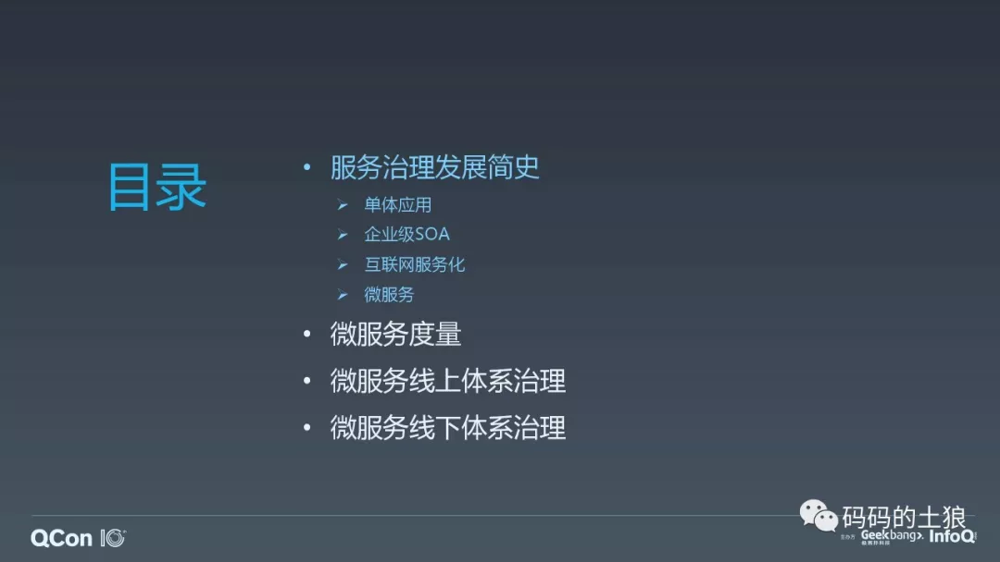
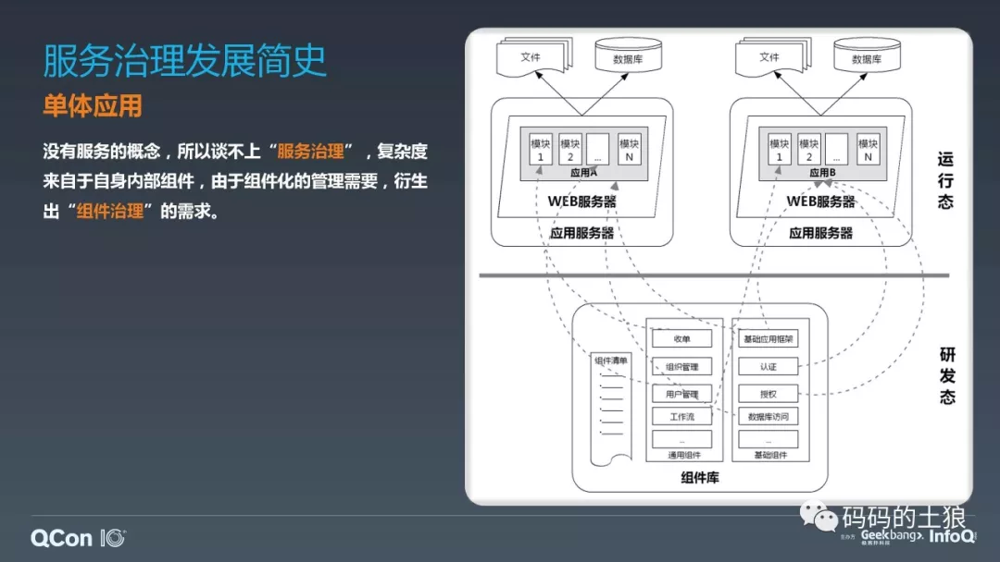
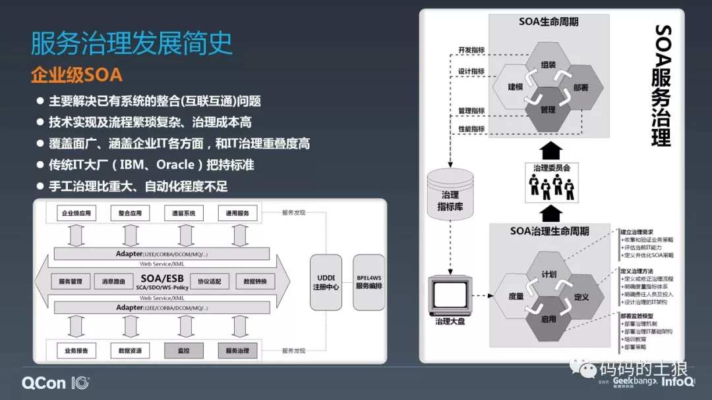

# 微服务架构体系的深度治理

- 天弘基金李鑫

**2019 年 5 月 19 日

**[架构](https://www.infoq.cn/topic/architecture)[微服务](https://www.infoq.cn/topic/microservice)[方法论](https://www.infoq.cn/topic/methodologies)

> 微服务模式下，庞大的服务节点数量、日趋复杂的服务分层、离散的组织协同、扁平化的管理模式让服务治理的广度、深度、难度都达到前所未有的程度。单纯依靠微服务框架层面的治理是远远不够的，需要构建贯穿研发、测试、运维、管理各领域的立体式的深度治理体系。
>
> 本文整理自天弘基金（余额宝）移动平台技术总监兼首席架构师李鑫在 QCon 全球软件开发大会（北京站）2019 上的演讲，他基于自身多年微服务治理的实践经验及感悟，全面地介绍了如何构建完备的微服务治理的指标体系及治理模型，并通过自动化的线上线下一体的“度量”及“管控”这两大能力的构建来综合解决微服务全生命周期的现实治理需求。[点此下载完整版PPT。](https://2019.qconbeijing.com/schedule?utm_source=infoq&utm_campaign=full&utm_term=0517)

在 QCon10 周年的大会上，我做了题为《微服务架构体系的深度治理》的分享，现将 PPT 和演讲文稿整理出来，希望能够给仍在（微）服务治理迷局中夺路狂奔的同学们一点启发和指引。

这次分享首先介绍了服务治理的发展历史，它的 4 个阶段；接着重点介绍微服务度量及分析体系的构建；最后，分别针对微服务线上及线下体系的治理进行深入探讨。

“治理”这个词，在汉语词典中是“整治、修整”的意思。**任何一个事物，当它的复杂度达到一定程度时，就可能出现问题，我们需要对问题进行梳理、改进和优化**。因此，**对事物的治理，本质上是对事物复杂度的管理**。同样的，**服务治理就是对服务复杂度膨胀问题的管控及管理**。

## 【单体应用及其治理需求】

在业务发展的早期，我们也许用一台机器就能扛住线上所有用户的访问，所有的功能和模块都被整合在一个单体应用中，独立部署，这在企业应用中非常普遍。

这个时期没有什么“服务化”的概念，也自然谈不上服务治理。**系统的复杂度更多来自于系统内部组件间相互调用及依赖关系，很多企业都会维护一个庞大的组件库，力图通过“搭积木”的方式来构建应用系统**。由于**组件之间存在版本和依赖性方面的问题**，所以需要进行**组件治理**，这是单体应用治理方面的主要需求。我在从事企业级应用开发的时候，做过一段时间组件治理，组件库的构建和维护比较复杂，有一套自己的方法论体系。

## 【企业级 SOA 及其治理】

随着企业 IT 建设的不断深入，系统越建越多，系统之间有了互联互通及整合的需求。为了实现系统整合，早期业界尝试过很多技术，一种是最简单的点对点直连模式，另一种是基于 RMI、COBAR、DCOM 这类中间件技术搞的星形连接模式，但效果都不太好，都没办法彻底解决标准化的问题。

后来，IBM 联合一些大厂推出了面向服务的架构（SOA），并制定了一系列的标准。SOA 最核心的诉求就是构建一条**企业服务总线**（ESB）。通过 SCA 规范开发服务适配器，将不同的异构系统接入服务总线，通过 SDO 标准进行请求数据封装，服务之间通过 WebService 协议进行互相调用，通过 BPEL 流程标准对服务进行流程化的编排，创建出来的服务可以通过 UDDI 协议对外暴露，以供第三方应用或服务调用。由于涉及的软、硬件资源越来越多，“治理”的需求也就应运而生。事实上，服务治理这个概念是随着 SOA 技术的兴起被同步提出来的。

这个时期的服务治理规范基本上被 IBM 这些传统 IT 大厂一手把持，比如 IBM 的 SOA Governance & Management Method(SGMM)标准。我们知道 IBM 做事有一个特点，喜欢把简单的事情复杂化，它的这套 SGMM 标准全面覆盖企业 IT 的管理流程、工具及基础设施建设、甚至企业的组织架构，定义了一堆的人员角色、规范、做事流程，非常复杂。你得掏钱来让他给你做咨询才能把这套体系玩起来，整个技术栈及流程太重了，对人的要求也非常高。这严重制约了它的推广和普及，但它的一些思想还是很好的，比如重视各个环节的指标采集和度量，重视全生命周期的治理，这些都可以给我们有益的启发和参考。

## 【互联网服务化及其治理】

2010 年之后，伴随着互联网应用的大规模爆发，又兴起了一股由互联网企业主导的所谓“轻量化 SOA”的技术浪潮，也就是我们常说的“分布式服务化”技术。

这一阶段，服务化的目标不仅要解决系统间的整合问题，还要解决系统的**可伸缩性**问题。大量互联网公司开始对自己的系统进行“服务化”改造，以期获得横向扩充的能力，应对快速增长的业务和访问量。这一时期使用的技术五花八门，有使用代理网关模式，也有采用 RPC 直连方式，技术上没有统一的标准，也涌现出了像 dubbo 这样的明星产品。

这个时期的服务治理更多是聚焦在对服务的线上生命周期的管控及治理上，包括服务的限流、降级、容错，以及服务的弹性伸缩、灰度发布等等，线下的治理基本上不涉及。

我们知道，2C 业务服务多、节点多，由于涉及到大量的服务节点，靠人肉的方式是肯定管不过来的，因此这一时期的服务治理很强调自动化，尤其是和自动化运维技术结合在一起。

## 【微服务及其治理】

互联网发展到今天已经成了一种基础资源，越来越多的业务被搬到线上，线上的竞争也越来越激烈。互联网企业为了生存，就要去竞争、去打仗。为了适应业务的快速发展，在技术迭代上一定要“**快**”，所谓“**天下武功、唯快不破**”。

“服务化”是实现“快”的一个非常重要的手段。把大量通用功能下沉为服务，并对服务不断进行拆分，再根据不同的业务形态，快速组装出前端应用，通过服务组装和聚合的方式实现更快的开发速度，前端也能变得更轻。把服务拆得越细，服务的粒度越小，可组装性就越好。只有这样，我们才能在业务有需求的时候，利用大量的“小服务”快速构建出一个前端业务应用，支持业务的快速试错。

随着近几年容器技术的快速发展，服务封装及部署的成本越来越低。一方面，服务被拆的越来越小，成了“微服务”，另外一方面，随着业务的发展，平台规模越来越大。“**大平台、微服务**”已经成了我们这个时代的一个典型技术特征。量变导致质变，我们的开发模式、测试模式、运维模式都会受到冲击。

这就很有意思了，业务的发展决定了我们一定会走上微服务之路，根据康威定律，我们的组织架构、管理策略、研发模式都要做出相应的调整，才能保证微服务架构的平稳落地。

这一阶段的服务治理不再局限于线上的治理，也要同步延伸到线下领域，实现线上线下一体化及立体化的治理。面对越来越复杂的环境，我们不仅要实现治理自动化，更要实现治理智能化，大量的算法被利用于服务质量及服务关系的洞察及服务管控上，只有这样，才能应对层出不穷的新的问题。

## 【微服务治理整体架构：三位一体的体系】

这里直接给出微服务治理的整体架构图，微服务的治理既要进行线上的治理，也要进行线下的治理，通过线上线下两大维度进行治理指标的采集，并把它汇总到数据仓库中，进行统一的度量和分析。

这些度量指标中，有相当一部分线上的性能及异常指标会被转化为运维事件，一旦触发我们预先设置的阈值，就会被进一步转化成“管控指令”，并通过调度中心下发，进行服务的弹性伸缩、扩容缩容操作，或者进行服务的限流、降级、容错、路由调整等管控操作。

另外一部分度量指标，包括架构、开发、测试、运维、过程协作效率等指标会通过治理委员会（泛指，治理成员的集合）进行人为的深入分析，并制定出治理决策，这些治理决策会通过相关的管理措施进行落地。

这样，我们就通过服务的**度量、管控、管理**这三大举措，构建起一个三位一体、围绕服务治理的闭环体系。

从前面的介绍可以看到，微服务治理体系中，针对微服务的度量是进行微服务管理和管控的前提和基础，“只有看得到，才能管得到”，接下来，我们就来重点介绍如何构建微服务的度量及分析体系。

管理学大师彼得.德鲁克说过“如果你不能度量它，你就无法改进它”，强调的就是度量的重要性。

## 【微服务全生命周期度量指标采集】

度量的第一步，就是度量指标的采集。

前面介绍了，微服务的治理囊括了线上及线下体系，同样的，服务治理度量指标的采集也要线上线下同步进行。

在线上，可以通过服务注册中心获取到服务的注册信息及服务的管控指令信息，通过各个微服务主机节点上的主机日志、应用及服务日志、APM 监控的调用链日志，可以获取到相关的性能及异常指标信息。

线下的指标就更多了，通过需求管理系统，可以采集到 UserStory 及各类需求的基本信息；通过项目管理系统可以采集到开发人员、开发团队、开发任务的基础信息；通过测试相关的管理系统可以采集到测试用例及测试 bug 的相关定义信息及过程指标信息；通过源码仓库及软件版本仓库可以采集到最终研发产出物的基本信息。

软件研发是一个强调协同的群体行为，产品、开发、测试、运维需要紧密合作。为了达到更高效的配合，我们经常会采用一些协作模式，比如针对开发和测试之间的配合，会采用持续集成（CI）；针对产品、开发、测试的协作，会采用敏捷协作模式；另外，我们可能还会使用一些 DevOps 的 Pipeline。不管我们采用何种协作模式，都可以从其相关的过程管理系统中抽取出相关的过程指标事件，比如一个任务什么时候完成设计、什么时候开始进入开发、什么时候完成开发…等等，这也是一大类很重要的治理度量指标。

有了以上这些线上线下指标，就可以将它们统一汇总到数据仓库，进行进一步的深度度量和分析。

我们介绍的指标已经很多了，也很全了，但是不是有了这些就足够了呢？总感觉还少了些什么…

## 【通过代码来“理解”代码】

不知道大家是如何使用你们的源代码及源代码仓库的？做做 codereview？或者用静态代码扫描工具扫扫代码质量？其实，我们完全可以做的更多。

通过管理只能做到对过程的优化及规范化，但你很难通过管理去提升软件内在的架构设计质量及代码质量，因为它是和研发人员的能力及自我要求息息相关的，并且需要进行长期的训练。

我之前在负责构建微服务治理体系的时候，发现如果要对架构的质量及研发的质量进行深度的度量及治理的话，是无论如何都绕不过源代码的，为什么这么说呢？软件研发它是一项协作性的智力行为，在研发过程中，需求人员、设计人员、研发人员需要进行紧密的协同和配合，这些人所有的思考、意图、策略最终都会体现在代码上。可以说，一个系统的代码就是一本“书”，你只要读懂了这本“书”，你就知道这个系统的前世今生。

但问题是，你如何读懂这本“书”，相信大家都对自己负责的系统的源代码非常熟悉，但是，你们能否做到对你们整个服务集群中所有服务的源代码都非常熟悉呢？这显然不可能，要读懂这一堆的“书”，靠人力是显然不行的，我们需要借助一些自动化的手段。

正是基于以上的思考，我们开发了一套针对源码仓库中所有工程源码进行统一扫描的工具。它的核心是 eclipse 中负责源码解析的 AST 组件（Abstract Syntax Tree，中文为抽象语法树），通过 AST，可以获取到源码工程中任何一个 Java 源码文件中所调用的外部类、继承或者实现的接口（父类）、类变量集合、类方法集合、方法逻辑块（多层嵌套）、注释等等基本信息，有了这些基本信息之后，通过对代码的逐行扫描，并基于一系列的正则及其它匹配，就可以获取到一个方法对其它方法的调用关系，最终汇总之后，就可以构建出一个跨工程、方法一级的非常庞大的**调用关系矩阵**，微服务之间的调用关系则是这个调用矩阵的一个**子集**。这个调用关系矩阵和基于动态调用链路跟踪所获取到的调用链路非常类似，我给它起了一个名字叫**静态调用链路**。有了这个静态调用链，实际上，我们就有了代码内的逻辑关系，在它基础上，就可以进行深度的架构关系及代码质量的梳理，这在后面的介绍中会有详细的讨论。

## 【微服务度量及分析体系】

有了以上所有这些度量指标，包括前面重点介绍的代码一级的静态调用链路（矩阵），就可以来看看最终针对微服务治理的度量及分析体系是个什么样子。

从下往上看，首先通过各个指标来源渠道获取到各类度量指标，并把它们以 ODS（操作型数据）的格式汇总到数据仓库；通过数据模型抽取出主数据（MDM），这些主数据包括了服务、需求、任务、人员、团队等，在此基础上，通过不同的数据主题（Topic）构建起一个多层的“数据集市”，这些数据主题包括了异常、性能、资源、调用关系、容量、系统、测试、开发、运维协同效率等；有了这个数据集市，就可以在其基础之上进行各类数据分析，包括性能分析、容量分析、健康度分析、团队及个人的质量报告、质量趋势、动态调用链及静态调用链的深度梳理、以及各维度的汇总报表。

根据这些分析报告，由治理委员会进行深度的分析并制定出各类的治理决策，或者通过人为或自动化的机制发出各类管控指令。

**治理决策**和**管控指令**就是微服务度量及分析体系的最终产出物。

有了治理决策和管控指令，就可以对微服务的线上及线下体系进行治理，首先来看一下对线上体系如何进行治理。

## 【服务限流】

服务限流是微服务集群自我保护的一种常用机制，我们对线上调用比较频繁及资源占用较大的服务都加上了相应的限流举措，并构建了单机限流及集群限流两套限流措施。

首先来看一下单机限流，它有多种限流算法可供选择，最主要的是两种，漏桶算法及令牌桶算法。它们之间有什么区别呢？打个比方，比如有家酒吧已经客满了，保安开始限制客流，一种举措是酒吧中出来一个客人，才放进去一个客人，这样就可以保证酒吧中的客人总数是固定的，人人都有座位，这就是漏桶算法—必须有出去的，才能有进来的；另外一种举措是不管有没有客人出去，保安固定每隔 5 分钟就放一个客人进去，这和春运火车站的波段式限流非常类似，可以保证客流是比较均匀的，但是这种策略也有一定的风险，如果离开的客人不够及时，酒吧中的客人总数可能会升高，导致一部分客人没有座位，这就是令牌桶算法。因此，如果要对线上并发总数进行严格限定的话，漏桶算法可能会更合适一些，这是单机限流机制。

接下来再看看集群限流，集群限流的情况要更复杂一些，首先在各个微服务节点上要有一个计数器，对单位时间片内的调用进行计数，计数值会被定期的汇总到日志中心，由统计分析器进行统一汇总，算出这个时间片的总调用量，集群限流分析器会拿到这个总调用量，并和预先定义的限流阈值进行比对，计算出一个限流比例，这个限流比例会通过服务注册中心下发到各个服务节点上，服务节点基于限流比例会各自算出当前节点对应的最终限流阈值，最后利用单机限流进行流控。

我们可以看到，这是一套环环相扣的、各环节紧密协作配合的技术体系。单纯拎出一个点来看，实现技术都不麻烦，但要构建起这么一套贯穿整个技术栈的技术体系，则需要有一套统一的技术标准，各个环节都需要遵循这套标准，对不符合标准的应用还要推动其进行改造，才能保证标准落地，有了标准之后才能推动各环节一点一点的改造构建起这套限流技术体系，所以构建服务限流能力的难点，一在于**标准化**，二在于**体系化**。

另外，限流一大原则是**限流动作尽量前置**，毕竟被限制的流量注定要被“抛弃”，越早处理越好，免得无谓的消耗资源。

## 【集群容错】

接下来再来看看集群容错，集群容错是微服务集群高可用的保障，它有很多策略可供选择，包括：

- 快速失败（Failfast）
- 失败转移（Failover）
- 失败重试（Failback）
- 聚合调用（Forking）
- 广播调用（Broadcast）

不管用哪种集群容错策略，一定要注意重试的次数，尤其是线上负载已经很高的时候，这时候如果重试次数太多，一方面，会推高服务被调用方的负载及并发，另外一方面，会导致服务调用方的调用延时增长，双重因素叠加之下，最终极可能导致“服务雪崩”，导致集群被“击穿”。

所以，**在使用集群容错的时候，一定要设置最大重试次数**。

## 【服务降级】

服务降级和服务限流类似，也是微服务集群自我保护的机制，一般在线上动用服务降级手段的时候，都是线上比较危急的时候，生死存亡了，这时候留给你思考和反应的时间已经不多，所以在使用服务降级之前一定要做好预案，你要**提前梳理出核心业务链路和非核心业务链路**，然后通过**降级开关**一键把部分或所有非核心链路降级，这样才能救命。

服务降级也有很多手段可以使用，包括：

- 容错降级
- 静态返回值降级
- Mock 降级
- 备用服务降级

我们常说的**熔断，本质上也是容错降级策略的一种，只不过它比一般容错降级提供了更为丰富的容错托底策略，支持半开降级及全开降级模式**。构建服务降级能力也和限流机制类似，同样需要坚持标准化和体系化。

## 【故障定界定位】

线上的故障定界定位应该是我们每天做的最多的事情。**分布式环境下的故障定界定位，最有效的工具就是动态调用链路跟踪**，这应该是没有疑义的，不管你是使用开源的 Zipkin，SkyWalking、PinPoint、CAT，还是使用商用的听云、AppDynamic 或 NewRelic 等等。

调用链本质上也是基于日志，只不过它比常规的日志更重视日志之间的关系。在一个请求刚发起的时候，调用链会赋予它一个跟踪号（traceID），这个跟踪号会随着请求穿越不同的网络节点，并随着日志落盘，日志被收集后，可以根据 traceID 来对日志做聚合，找到所有的关联日志，并按顺序排序，就能构建出这个请求跨网络的调用链，它能详细描述请求的整个生命周期的状况。

动态调用链要用的好一定是需要和监控大盘相结合。介绍一下我们的使用经验，我们在很早之前就构建了动态调用链跟踪体系，在我们的监控大盘上有很多的点可以进入调用链：

1、我们有一个单位时间段内异常最多服务的 TopN 排序列表，点击列表上的任何一个服务，会打开这个服务这个时间段内所有异常的列表，再点击列表上的每一个异常，就会打开这个异常所属调用链，进行故障分析。

2、可以利用监控大盘，监控大盘上有很多“毛刺”，这些都是系统的一些异常点，点击任何一个“毛刺”，会将“毛刺”所在时间段内的请求以“散点”的形式列出（可能会基于请求数量做抽样），“散点”的颜色代表了不同的状态，有的成功，有的失败。点击任何一个“散点”，就可以进入这个请求对应的调用链。

3、针对核心服务的异常有专门的一个监控表格，会列出最近发生的核心链路服务上的异常，点击这上面的任何一个异常，也可以进入对应的调用链。

以上就是基于动态调用链进行线上故障定界定位的常用模式。

## 【容量规划】

线上的流量今天涨一点，明天涨一点，如果麻痹大意的话，说不定哪天服务就被冲垮了，所以要对线上的流量时时进行规划，以做到心里有数。

容量规划有两种形式，一种是**容量预估**，另一种是**性能压测**。

系统或者服务上线之前，首先要进行容量的预估，一般做法是基于经验，同时结合对业务的前景预期，先估算出一个总的调用量，比如 1 亿的 PV，可能会有 10%的流量落在购物车服务上，购物车服务就是 1000 万的 PV，一次购物车访问会产生 2 次数据库调用，那么它的关联数据库就会有 2000 万的一个调用量，这样，基于图上从左至右，层层分解之后，就可以获取到每个服务节点上摊到的访问量，再结合运维部门的单机容量指标，就可以估算出整个集群需要多少的软硬件资源。

系统或者服务一旦上线之后，它的性能就开始处于不断“劣化”的状态，上线前预估的指标会越来越不准，这时候就需要通过线上性能压测来对实时容量进行监控。做线上性能压测也要遵循一定的规律，不是说一上来就做全链路压测。同样是基于上图中的调用关系，线上性能压测首先需要在调用链的末梢，也就是对数据库或者缓存先进行压测，以保证它们不是瓶颈，再对调用数据库或者缓存的上一级节点进行压测，再一级一级往上压测，最终覆盖整个链路，实现全链路压测。

可见，全链路压测的前提是单点压测，需要先把单点压测能力做好，才能做全链路压测。

在压测的时候，由于流量是模拟的，数据也是“伪造”的，所以一定要做好隔离，各种各样的隔离，尤其是数据的隔离，我个人不建议将“染色”的压测数据和真实的线上业务数据共表存储，最好将“染色”数据单独表进行存储，并通过分表策略进行区隔。

以上就是性能规划，包含了容量预估与性能压测两大能力。

## 【微服务关联资源的治理】

对于线上任何资源，如果只有服务对它进行调用，那么完全可以基于服务对资源的**调用日志**来分析资源的使用状况、性能状况。

比如，对于数据库，可以汇总对某个数据库访问的所有服务的调用日志，多维统计之后，就能知道数据库整体被调用状况，及数据库中表的调用的分布状况，每个表的被调用状况，包括被写入了多少数据、被删除了多少数据、被修改了多少数据，每次查询的调用延时统一汇总之后，推算出每个表的查询操作的整体表现及相关的慢查询等等。

对分布式缓存，也可以汇总所有的读、写操作，并计算出读写比例，也可以基于每次的调用结果（是否为 null、是否异常）汇总出命中率，正常的缓存表现应该是读多写少，如果推算出的读写比例是读少写多，或者命中率偏低，说明缓存的使用策略有问题，需要进行改进。

对消息队列也类似，可以通过调用日志，计算出单位时间内写入的消息量，以及被消费的消息量，据此推算出消息队列当前的堆积情况。

通过调用日志获取的资源的使用及性能状况，比通过资源自身的监控所获取到的相关指标会更客观一些，毕竟它代表了应用/服务的真实感受。比如对于数据库的访问，请求需要先通过服务的数据库连接池，再穿越网络，最后才到达数据库，这中间任何一个环节出现问题，都会影响到最终的调用效果。

除此之外，还可以通过服务的调用日志对资源的使用状况进行优化。对线上运维而言，比较头疼的问题是资源分出去之后就收不回来了，因为你也不知道资源是否还在使用，如果结合服务侧的调用日志监控来做资源使用判定的话，则能有效的解决这个问题，比如说，如果通过调用日志发现对某个 namespace 下的缓存已经没有调用了，那完全可以考虑将这个 namespace 的缓存资源释放掉。

## 【微服务线上生命周期管理】

我们目前针对微服务的线上生命周期管控的能力是基于蚂蚁金融云的能力来构建的，蚂蚁金融业在它的云上弹性计算资源的基础上，通过整合资源编排及资源调度的能力，构建了微服务的综合管控平台，通过这个平台，可以比较方便的进行服务的上线、下线、扩容、缩容等操作。

以上就是针对微服务线上体系的治理，实际上，这些能力都是微服务的通用能力，很多微服务框架都具备，我这里只是重点介绍了我们的使用经验及心得。接下来我们来讨论一些更加硬核一点的内容，来看看微服务的线下体系的治理。

## 【微服务整体架构治理】

首先看一下针对微服务的整体架构的治理。

先看第一个图，这个图是线上微服务集群服务间的**调用关系总图**，这个图可以通过动态调用链的汇总来获取，目前大部分公司都是这么干的；除此之外，还可以基于我前面介绍的静态调用链（调用矩阵）来获得，这个图只是静态调用矩阵的一个子集，通过静态调用链获取到的这个图中的调用关系会比动态调用链更多，有了这个微服务间的整体调用关系之后，我们就可以对微服务的调用质量进行深入的分析。

服务是分层的，好的服务调用关系一定也是分层的，层层往下推进，最终形成一个有向无环图（DAG）。因此，可以对调用关系图进行闭环检测，如果检测到如图上 G 点到 B 点这样的**回环调用**的话，说明调用关系是有问题的，需要进行优化，这种回环调用也许现在无感，但难保未来哪天就会由于一条旁路逻辑导致死循环。

还可以对整个调用网络进行遍历计算，找出所有调用**深度最深**的调用链，如图上红色标注出来的调用链，我们知道，对跨网络的调用访问，涉及到的网络节点越多，它的稳定性越差，可以将所有调用链路最深的这些链路找出来，并按调用深度进行 topN 排序，重点对排在头部的这些调用链分析它的必要性及合理性，看是否可以对调用深度进行缩减和优化。

还可以找出整个网络中被调用最多的这些服务节点，比如图上的 F 节点，从调用关系上来说，它是被依赖最多的节点，自然是最重要的节点，作为枢纽节点，在运维等级上需要重点保障。当然，实际应用中，我们还会加上调用量这个权重来综合判定服务节点的重要性。

随着架构的不断演讲，可能有些服务节点再不会有调用关系了，比如图上绿色的 L 节点，这些节点再不会去调用别的服务节点，别的服务节点也不会来调用它。这类被找出来的“孤零零”的节点，可以考虑对它进行下线处理，以释放资源。

以上所有的度量和治理都是在这个调用关系图的基础上进行的，所用的算法也是图计算（图论）中的常用算法，包括 BFS、DFS、PageRank 等等，大家如果嫌麻烦，可以找个图数据库，比如 neo4j，这些算法已经集成在它的基本查询能力中。

## 【单个微服务架构治理】

微服务之所以被称为“微”，一方面是它承载的业务比较单一，另外一方面，它在架构上也要尽量的做到自洽和内敛，也就是说，它的设计要尽量的遵循“迪米特法则”，要**尽量少的和外部的系统或者服务发生交互**。

可以通过调用链对微服务的对外调用关系进行梳理和分析，如果对外调用关系过多，比如说，如(页面中)上图所示，它如果调用了 3 个外部的系统或者服务，可能是正常的，但如果它对外调用了 30 个服务，那就要好好分析一下它承载的业务是否太多，是否不够纯粹，是否需要对它进行拆分，拆成多个服务。

另外，既然同时具有动态调用链和静态调用链，完全可以将这两种调用链进行叠加，如(页面中)下图所示，红色部分是被动态调用链覆盖到的逻辑，非红色部分则是没有被触发的代码调用逻辑，这部分未触发逻辑中，有一部分是异常处理逻辑和旁路逻辑，可能是正常的，另外一部分则可能是版本兼容代码。比如说，线上 APP 有很多的版本，某个版本一旦下线，后台服务中针对此版本的兼容代码就成了冗余代码，需要进行清理。通过动态调用链和静态调用链的叠加，就可以相对方便的定期找出冗余代码进行清理，这样可以保证微服务的体量不会膨胀。

## 【微服务开发质量度量及治理】

针对代码质量的管理，常规的做法除了代码的 codereview 外，一般还会使用 Checkstyle，FindBugs，Jtest 这类静态代码扫描工具来做代码的缺陷扫描。其实我们还可以做的更深入和更广一些，基于前面介绍的自定义代码扫描的技术，结合代码的调用关系，我们完全可以做到对跨类和跨方法的调用缺陷进行扫描，比如跨方法的多层循环嵌套，这类缺陷通过常规的代码扫描工具是扫不出来的，

除了代码质量之外，还可以结合线上 bug 的种类和数量，来综合评估开发人员的开发质量，因为，代码是人写的，bug 也是人制造出来的，通过结合开发人员开发的代码的质量，及他的产出物产生的异常等级（类型及数量），就可以对开发人员的开发质量进行综合的度量。当然，实际中还会结合其它的指标，但这两个是最主要的指标之一。通过这两个核心指标，可以生成研发人员开发质量综合评估报告。

进一步汇总个人的质量综合评估报告，可以获得针对团队的开发质量综合评估报告，这两个报告本质上就是个人及团队的**研发质量“画像”**，完全可以作为个人及团队 KPI 考核的重要参考。在此基础之上，还可以通过这两个报告的变化趋势（时间纵比），来不断促使开发人员和开发团队不断进行开发质量的改进和开发技能的提升。

## 【微服务架构下的测试治理】

微服务架构下的测试治理的两大核心诉求，一个是**提高测试的覆盖度**，具体说就是提高需求覆盖度、代码覆盖度、页面覆盖度；另外一个则是**降低测试用例的维护成本**。

先讨论测试覆盖度。

首先看一下需求覆盖度，可以通过服务这个维度来对需求及测试用例进行关联，找出每个需求下所对应的单元测试用例、自动化测试用例、手工测试用例，在此基础上，可以把多个开发迭代周期的这些指标进行时间维度的纵比，以得出需求覆盖度的变化趋势。

代码覆盖度有很多的工具帮我们来做，比如 contest 或者 JaCoCo 这类的工具，这里不再赘述。

页面覆盖度，可以将每次集成测试中调用的页面以日志的形式记录下来，再通过日志的聚合分析，结合工程源码的扫描，两厢一比较，就可以统计出哪些页面是没有被覆盖到的。

测试用例的维护成本分两块，一块是**新增用例的维护成本**，这个比较好度量；比较麻烦的是**存量测试用例的变更度度量**，我们采用相似度匹配算法，先算出存量测试用例前后两个版本代码的相似度，再换算成变更度。

通过对测试的这两大类指标的不断度量和治理，可以实现测试工作的整体“降本增效”。

## 【调测能力构建】

在服务化的过程中，研发最大的痛点，一定是调试。原来单体应用中的服务被拆分到不同团队，并部署在不同的服务器上，而本地只有一个服务接口。这时候要做调试，要么做 P2P 直连，这需要搭建不同开发版本的集群，成本较高。要么做 MOCK，采用传统的 MOCk 手段，要写一堆的 MOCK 语句，比如你用 mockito，你要写一堆的 when……thenReturn….的语句，耦合度非常的高。

我们利用分布式服务框架提供的过滤器机制，开发了一个 Mock 过滤器，通过 Mock 数据文件来详细定义要被 mock 的服务的名称、入参及出参。这样，当请求过来的时候，将服务名及入参和 mock 数据中的定义进行比对，结果吻合，就直接将 mock 数据文件中的出参反序列化后作为服务的调用结果直接返回，同时远程调用的所有后续操作被终止。这样，通过 mock 数据模拟了一个真实的远程服务。通过这种方式来构建服务的 mock 能力，我们就不需要写一堆的 mock 代码了，而且整个过程对业务逻辑来说毫无感知，完全把 mock 能力下沉到底层的服务框架。

另外，为了有效降低制作 mock 文件的成本，我们还基于服务框架的过滤器机制开发了“在线数据抓取过滤器”，它可以将指定的服务请求的入参和返回结果都抓取下来，直接写成 mock 数据文件。通过抓取方式获得的 mock 数据文件，往往有更好的数据质量，毕竟反映的是更加真实的业务场景。不过，这里还有一个合规性的问题，对线上数据的抓取是种敏感行为，大部分公司这么干都会很谨慎，一般都要做好数据脱敏的处理工作。对于我们，目前只在测试环境中进行数据抓取操作。

通过以上的策略，可以有效改善服务化架构下团队的开发效率，而且团队规模越大，效果越明显。

## 【微服务架构下团队协同】

微服务架构下，服务被分散到不同的团队，经常一个业务会涉及多个团队之间的协同配合，如何让团队内部、团队之间的协作更高效？

我在前面说了，根据康威定律，组织协作的模式必须是和架构相匹配的，这方面我们也做了不同的尝试，从综合效果来说，**敏捷模式**会更适合微服务架构下团队之间的协同。我们目前采用两周一迭代、固定发版的模式，同时每个迭代之内，采用“火车发布模式”，实行班车制，准点发车，这样的话，其它协作部门在很早之前就能大概知道我们的一个发布计划，产品方面也大概知道要把需求放入哪个迭代之中。这样，能够有效减轻部门间的沟通成本。在每期工作量评估的时候，我们一般会预留一些工作量 buffer，以应对一些临时性需求，这类需求不受版本约束，按需发布。如果这个迭代周期内没有这类紧急需求的话，我们会从 backlog 中捞一些架构优化的需求来填补这些 buffer。

由于迭代周期很短，所以需要严控每个迭代的风险和不可控的因素，对每个迭代而言，最不可控的就是 UI 设计。UI 的设计过程中，感性的因素会更多一些，可能会反复修改多次，不像程序代码那么明确。所以，我们一般不将 UI 设计纳入迭代之中，而是将其作为需求的一部分，在每个迭代开始之前的工作量评估中，要求必须提供完整的 UI 物料，否则不予评估工作量，此需求也不会被纳入迭代之中。

## 【微服务架构下团队协同质量度量及治理】

团队的协同效率同样需要进行度量和治理。以我们所使用的敏捷迭代协作为例，我们采用**数据驱动的精益看板方法**，持续采集每个迭代中各个阶段的**过程指标事件**，比如任务什么时候完成设计、什么时候进入开发、什么时候开发结束、什么时候进入测试…等等，这些过程指标被汇总后，会在其基础上制作出精益看板中的几大典型报表：

- 韦伯分布图
- 累积流图
- 价值流图
- 控制图

通过这几个报表，就可以对需求流动的效率进行持续的评估，看研发管道是否有堆积？是否有阻塞？并进行实时的干预和治理，注意，这里评估的是协同的效率，而不是研发资源的利用率，对研发资源的利用率，我们有另外的度量指标和报表。

通过每个迭代持续的进行精益看板的数据分析和度量，并通过治理策略进行不断的改进优化，就可以让我们的研发协同越来越顺畅。

这里再次强调，以上**所有指标采集和多维分析和度量，直至最终分析报表的生成要最大可能做成自动化的方式，\**一键生成，否则，靠“人肉”的方式是无法完成如此繁琐的采集及制作任务、也无法保证时效性。这也是我在前面所强调的\**自动化**及**智能化**的治理。

以上就是本次分享的主要内容，介绍了服务治理发展的 4 个阶段的治理需求及特点，给出了微服务治理的整体架构；重点介绍了微服务度量及分析体系的构建，这是微服务管控及管理的前提和基础；最后，分别针对微服务的线上及线下体系的治理做了深入的讨论。

## 作者简介

天弘基金移动平台部任技术总监兼首架，主要负责天弘移动直销平台的整体技术架构和技术团队管理；在此之前，在华为的中间件技术团队，任六级技术专家，主导了多款华为软件的云计算产品的规划、设计、构建及落地工作，包括 APaaS、ASPaaS、服务治理平台、分布式服务调测框架等几款产品；更早之前，在当当网的运作产品中心做技术负责人，主要负责电商中后台的仓储、物流、客服等系统的重构优化及技术管理工作。

个人从业十多年，在并行计算、大规模分布式服务及治理、中间件云化及服务化（PaaS）、APM 监控、基础开发平台、数据集成等领域都有技术积累，如果大家在这些领域有疑问或好的建议，欢迎加我的微信号**（wx25893288）**共同探讨。

**QCon 全球软件开发大会（北京站）2019 已经圆满结束，QCon 上海 2019 即将起航，**[**点击此处了解详情。**](https://2019.qconshanghai.com/?utm_source=infoq&utm_campaign=7&utm_term=0517)

2019 年 5 月 19 日 16:0017148

**[架构](https://www.infoq.cn/topic/architecture)[微服务](https://www.infoq.cn/topic/microservice)[方法论](https://www.infoq.cn/topic/methodologies)