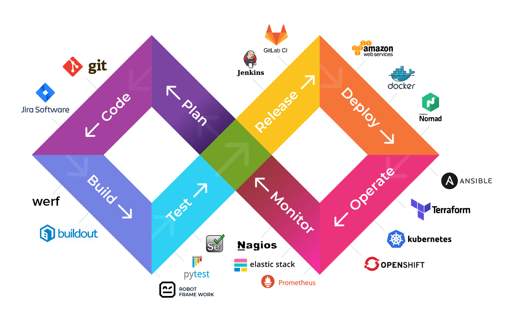

# 容器安全最佳实践入门

**2021 年 1 月 11 日

保证容器安全是一项复杂的任务。这个问题域很广，面对大量的检查清单和最佳实践，你很难确定采用哪个解决方案。所以，如果你要实现容器安全策略，应该从哪里开始呢？

我建议从最基本的开始：理解容器安全是什么，并构建模型来降低风险。

## 遵循 DevOps 生命周期

安全计划最终都会受到环境的限制，遵循标准的 DevOps 生命周期可以更好地发现模式和发挥协同效应。

DevOps 的生命周期是一个无限迭代的过程：

- 计划
- 编码
- 构建
- 测试
- 发布
- 部署
- 运维
- 监控

容器通过 Dockerfile 文件的形式包含在应用程序中，但实际上并不是应用程序的一部分。因此，计划和编码阶段与容器无关。

其余的每一个步骤都与容器安全有关，我对它们进行这样的分组：

- 构建时：构建、测试和发布。
- 容器基础设施：部署和运维。
- 运行时：监控。

为什么要这样分组？安全策略只有在能够被实现的情况下才是有效的。每个分组中的每一个步骤都共享了一个公共设施，可以很容易往其中注入安全控制元素：

- 构建时：CI/CD基础设施、容器注册表；
- 容器基础设施：容器编配器；
- 运行时：生产环境。

现在我们有了三个风险评估着手点。

## 构建时安全性

在构建阶段，我们输入了一堆源文件和一个 Dockerfile，得到了一个 Docker 镜像。

大多数供应商在这个时候向你强调容器镜像扫描的重要性。容器安全扫描的确很重要，但还不够。

> 这个阶段的目标：最小化供应链攻击风险。

#### 容器镜像“卫生”

首先，思考一下你的镜像应该是什么样的，并重点关注依赖项是如何引入的：

- 允许开发人员使用哪些基本镜像？

- 依赖项是固定的吗？是从哪里拉取的？

- 是否需要一些标签来简化监管和合规性?

- 检查一下Dockerfile。

- 在编写Dockerfile时遵循Docker安全最佳实践。

  

所有这些检查都是静态的，可以很容易在构建管道中实现。

#### 容器镜像扫描

然后，我们可以进行容器镜像扫描。

不要在构建管道中扫描镜像，而是在容器注册表中进行持续的扫描。

为什么要这样？服务不一定会进行不间断的构建，但漏洞会不断出现。其次，构建是增量的：每个构建都将生成一个新镜像。因此，假设你的容器编配器信任你的注册中心，所以你发布的每个标记总是可以部署并需要进行评估。

这个时候你就要开始考虑补丁管理和保存期限：

- 补丁管理：根据扫描结果提供补丁，生成新版本镜像；
- 保存期限：未修补/旧/不安全的镜像将从注册表中删除。

## 容器基础设施安全性

容器基础设施由负责从注册表拉取镜像并在生产环境中作为容器运行的所有活动部件组成。

这主要是容器编配器——Kubernetes。

> 这一阶段的目标：
>
> 1. 避免存在安全隐患的平台配置错误；
> 2. 最大限度地减少来自受损容器的攻击。

#### 基础设施安全性：配置错误

容器编配器比较复杂，特别是 Kubernetes。到目前为止，它都没有兑现 DevOps 的承诺。我认为，我们离成为不需要太多运维开销的主流解决方案还有一两个抽象层的距离。

每一个复杂的平台都很容易出现配置错误，而这正是你需要关注的部分。

你必须对基础设施进行威胁建模，确保它不会被攻击。这个特殊的威胁模型应该关注每一个参与者，但受损的容器除外(我们将在下面讨论这个问题)。

这里我就不详细讲了，因为这取决于你运行的是什么平台。对于 Kubernetes，建立威胁模型的一个着手点是[这样的](https://www.marcolancini.it/2020/blog-kubernetes-threat-modelling/)。

此外，如果你还没有这么做，可以考虑使用托管平台：如果你可以利用(受信任的)供应商提供的模型，复杂性就会降低。

#### 基础设施安全性：横向移动

接下来，我们来讨论当一个容器被破坏时会发生什么。

你想要最小化攻击者横向移动的能力，专注于以下两个层：

- 网络层
- 身份和访问管理层（IAM）

网络不应该是平的。你可以先把所有东西分配到子网络，然后建立起完整的服务网络。

在 IAM 层，为每个容器使用单一的标识，以此来优化授权。这在多租户平台中尤其重要：如果没有细粒度的身份标识，就不可能获得最小权限。

最后，由于它们是不可变的，所以最好是减少容器可以运行的时间：攻击者横向移动并获得持久性机会窗口等于容器运行生命周期。所以，持续关闭和滚动重启你的容器。

## 运行时安全性

最后一个是工作负载的安全性。到这个时候，大部分的强化工作都已完成，我们将进入反应性安全控制领域，也就是故障后（post-fail）。

> 这个阶段的目标：将受损容器的攻击影响降至最低。

#### 探测和事故响应

控制攻击影响面最好的办法是尽量缩短从入侵开始到安全团队收到警报之间的时间。

探测正在发生的漏洞是供应商们争相寻找解决方案的另一个领域。现在有很多方法，其中大多数都需要使用边车或守护进程来主动监控 Pod 流量和系统调用。

大多数解决方案都会提供一些价值，但我的建议是从简单的开始，并进行迭代：使用现有的 SIEM，摄取来自平台、应用程序和审计系统的日志。

发生事故是不可避免的，不过这没关系，只要你有相应的事故响应流程。

每次事后分析的第一个要点应该是：“下次我们如何更快地发现这个问题”？搞清楚这些问题可以让你发现自己的盲点，然后利用这些盲点来了解自己错过了哪些信号，以及什么东西是值得相信的。

## 结论

容器安全是一个广泛存在的问题，不仅仅是扫描镜像那么简单。这就是我建立的模型，用于分析容器风险和解决方案。它比较抽象，当然，和所有模型一样，它不一定是绝对正确的。我们都知道，每一个基础设施就像是一片雪花：以此为灵感去建立你自己的威胁模型。

原文链接：https://cloudberry.engineering/article/practical-introduction-container-security/

2021 年 1 月 11 日 12:20711

文章版权归极客邦科技InfoQ所有，未经许可不得转载。

原文：https://www.infoq.cn/article/z1pjPVUbRe3yIcsXR8uF