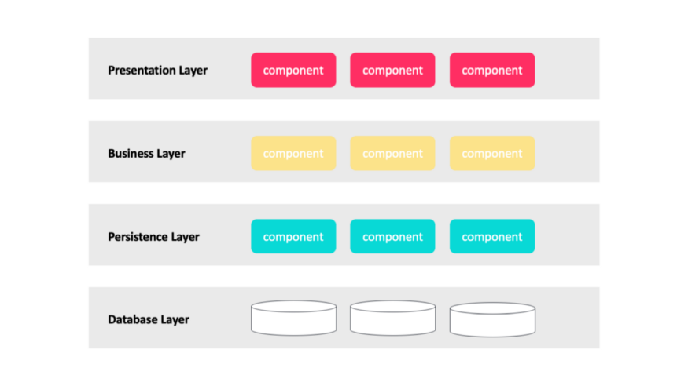
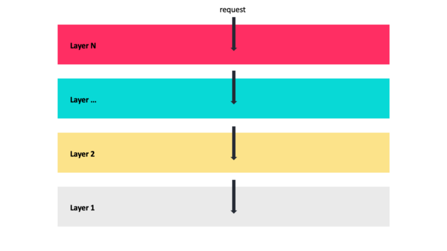
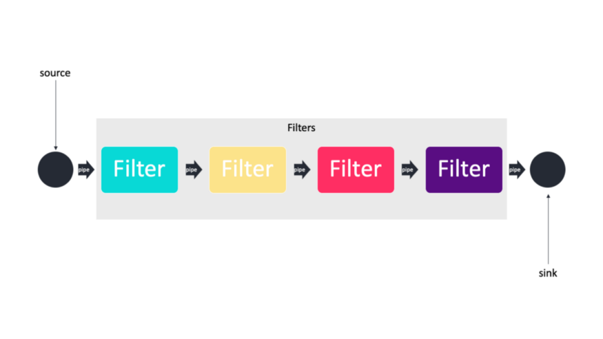
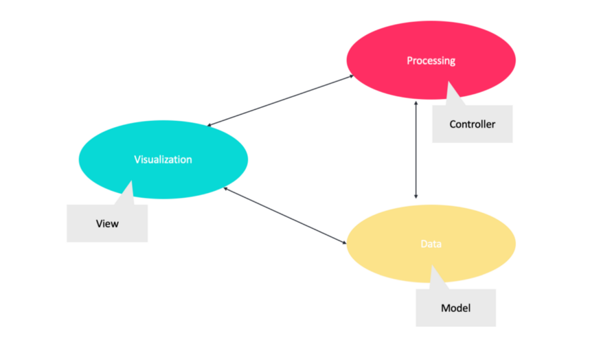
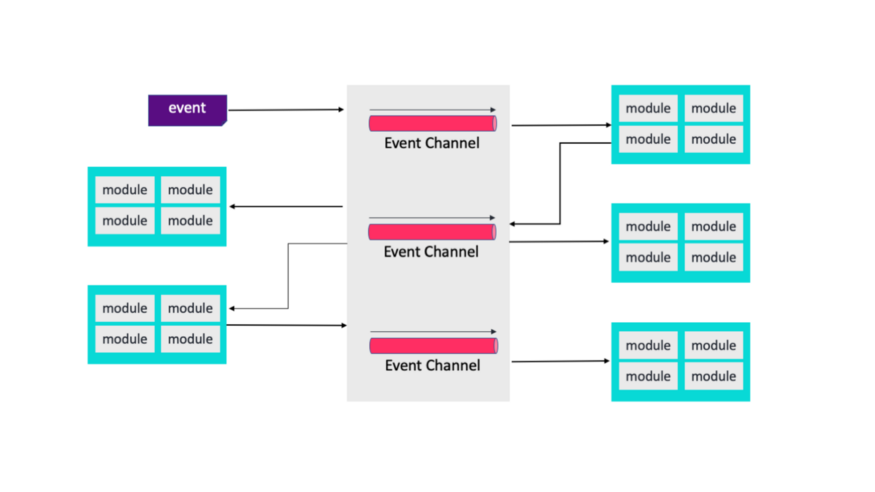
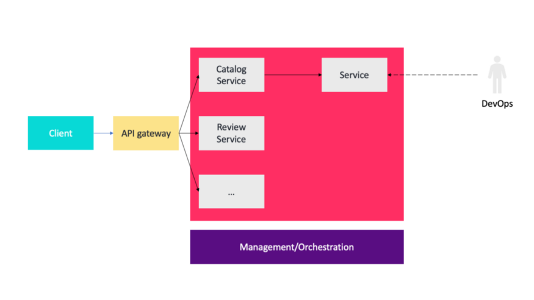

# 程序员必知的几种软件架构模式

- Trung Anh Dang

- 张健欣

- 万佳

**2020 年 10 月 26 日

架构模式是对给定上下文的软件架构中常见问题的一种通用的可复用的解决方案。然而，很多开发者至今还对各种软件架构模式之间的差别搞不清，甚至对其所知甚少。

> 一种模式就是特定上下文的问题的一种解决方案。

大体上，主要有下面这几种架构模式：

- 分层架构
- 管道-过滤器架构
- 客户端-服务器架构
- 模型-视图-控制器架构
- 事件驱动架构
- 微服务架构

程序员必知的几种软件架构模式

## 1 分层架构模式

最常见的架构模式就是分层架构或者称为 **n 层架构**。

大部分软件架构师、设计师和开发者都对这个架构模式非常熟悉。尽管对于层的数量和类型没有具体限制，但大部分分层架构主要由四层组成：**展现层、业务层、持久层和数据库层**，如下图所示。

一个很流行的 n 层架构示例

### 上下文

所有复杂的系统都会经历**独立地发展和衍化系统各个部分的需要**。出于这个原因，系统开发者需要**对关注点进行清晰且条理分明的分离，以便系统的各个模块可以独立地开发和维护**。

### 问题

软件需要以这样一种方式分割：

- **各个模块可以独自开发和衍化**
- **各自部分之间的交互非常少**
- **支持可移植性、可修改性和复用性**

### 方案

**为了实现关注点分离，分层模式将软件分割成各个单元（称为“层”）**。**每一层都是一组模块，提供了一组高内聚的服务**。其**使用必须是单向的**。层将一组软件作为一个完整的分区，每个分区暴露一个公开接口。

- 第一个概念：**每一层都有特定的角色和职责**。例如，展现层负责处理所有的用户界面。分层架构的这种关注点分离，让构建高效的角色和职责非常简单。
- 第二个概念：**分层架构模式是一个技术性的分区架构，而非一个领域性的分区架构**。它们是由组件组成的，而不是领域。
- 最后一个概念：**分层架构中的每一层都被标记为封闭或者开放**。封闭层意味着请求从一层移到另一层，它必须通过它正下面的这一层才能达到下面这一层的再下一层。请求不能跳过任何层。

封闭层和请求访问

### 弱点

- 分层会导致性能下降。这种模式**不适合高性能应用程序**，因为经过架构中的多层来实现一个业务请求的效率是不高的。

- 分层还会增加系统的前期成本和复杂性。

### 用途

- 我们应该将这种方式应用于小型简单的应用程序或网站。
- 对于预算和时间非常紧张的场景，这是一个不错的选择。

## 多层模式

### 方案

一个多层模式示例：消费者网站 J2EE

许多系统的执行结构被组织成一系列逻辑组件分组。每个分组被称为一个层。

**上下文**：在一个分布式部署中，通常需要将系统的基础设施分到不同的子集中。

**问题**：我们如何将系统分割到多个计算上独立的执行结构：由一些通信媒介连接的软件和硬件组。

**弱点**：大量前期成本和复杂性。

**用途**：用在分布式系统中。

## 2 管道-过滤器架构

软件架构中反复出现的一种模式是管道-过滤器（pipe-filter）模式。

管道过滤器模式

### 上下文

- 许多系统需要**转换从输入到输出的离散数据流**。
- **许多类型转换在实践中重复出现**，因此将其创建成独立的可复用的部分，这是比较理想的。

### 问题

这些系统需要被分割成可复用的松耦合的组件，组件之间拥有简单通用的交互机制。这样它们就可以灵活地相互结合。这些通用松耦合的组件就很容易复用。那些独立的组件可以并行执行。

### 方案

这种架构中的管道构成了过滤器之间的通信通道。第一个概念是，由于性能原因，每个管道都是非定向的和点对点的，接受来自一个源的输入并经常直接输出到另外一个源。

在这种模式中，有如下四种过滤器。

- producer（`source`）：一个过程的起点。
- transformer (`map`)：对一些或所有数据进行转换。
- tester (`reduce`)：测试一个或多个条件。
- consumer (`sink`)：终点。

### 弱点

- **不太适合交互性的系统**，因为它们的转换特性。
- **过多的解析和反解析会导致性能损失**，也会增加编写过滤器本身的复杂性。

### 用途

- 管道-过滤器架构用于各种应用程序，特别是简化单项处理的任务，例如 EDI、ETL 工具。

- 编译器：连续的过滤器执行词法分析、语法分析、语义分析和代码生成。

## 3 客户端-服务器架构

### 上下文

有许多共享资源和服务是大量分布式的客户端希望访问的，我们希望控制访问或服务质量。

### 问题

- 通过管理一组共享资源和服务，我们可以**通过分解公共服务，并在单个位置或少数位置进行修改，来提高可修改性和复用性**。
- 将资源本身分布在多个物理服务器上的同时，集中控制这些资源和服务，来提高可伸缩性和可用性。

### 方案

在客户端-服务器模式中，组件和连接器具有特定的行为。

- 称为“客户端”的组件将请求发送到称为“服务器”的组件，然后等待回复。
- 服务器组件接收到客户端的请求并向其发送回复。

### 弱点

**服务器会成为性能瓶颈和单点故障位置**。

在系统建成后，关于功能位置（在客户端还是在服务器）的决策通常是复杂的而且变动成本很大。

### 用途

对于有许多组件（客户端）发送请求到另外一些提供服务的组件（服务器）的系统，我们可以使用客户端-服务器模式来建模这个系统的一部分：在线应用程序，例如电子邮件、共享文档或银行服务。

## 4 模型-视图-控制器架构（MVC）

### 上下文

用户界面通常是一个交互性应用程序的最频繁被修改的部分。

**用户通常希望从不同的视角查看数据**，例如柱状图或者饼图。**这些表示形式都应该反映数据当前的状态**。

### 问题

- 用户界面功能如何独立于应用程序功能，同时还还对用户输入或底层应用程序数据的更改做出响应？

- 当底层应用程序数据更改时，如何创建、维护和协调用户界面的多个视图？

### 方案

模型-视图-控制器（model-view-controller，即 MVC）模式将应用程序功能分为以下三种类型的组件：

- 模型：包含应用程序的数据。
- 视图：显示部分底层数据并与用户交互。
- 控制器：在模型和视图之间进行中介并管理状态更改的通知。

### 弱点

- 对于简单的用户界面，其复杂性并不值得这么做。

- 模型、视图和控制器抽象可能不适用于某些用户界面工具包。

### 用途

MVC 是网站或移动应用程序开发用户界面常用的一种架构模式。

## 5 事件驱动架构

### 上下文

需要提供计算和信息资源来处理传入的应用程序生成的独立异步事件，这种方式可以随着需求的增加而扩展。

### 问题

构建分布式系统，这个系统可以服务异步到达的事件相关信息，并且能从简单小型扩展到复杂大型。

### 方案

为事件处理部署独立的事件进程或处理器。到达的事件进入队列。调度程序根据调度策略从队列中拉取事件并将它们分配到合适的事件处理器。

### 弱点

性能和错误恢复可能是问题。

### 用途

使用这个方案的电商应用程序将工作如下：

Order Service 创建一个 Order，这个订单处于待定状态，然后发布一个`OrderCreated`事件。

- Customer Service接收到这个事件，并尝试为这个Order扣除信用。然后发布一个Credit Reserved事件或者`CreditLimitExceeded`（超出信用限额）事件。
- Order Service接收到Customer Service发送的事件，并将订单状态更改为已核准或已取消。

## 6 微服务架构

### 上下文

部署基于服务器的企业应用程序，支持各种浏览器和原生移动客户端。 应用程序通过执行业务逻辑、访问数据库、与其它系统交换信息并返回响应来处理客户端请求。这个应用程序可能会暴露一个第三方 API。

### 问题

一体化应用程序会变得过于庞大和复杂，无法得到有效支持和部署来实现最优的分布式资源利用，例如在云环境中。

### 方案

将应用程序构建成服务套件。

- **每个服务都是独立部署和可扩展的，拥有自己的 API 边界**。
- 不同的服务可以用不同的编程语言编写，管理它们自己的数据库，由不同的团队开发。

### 弱点

- 系统设计必须能容忍服务失败，需要更多的系统监控。
- 服务编排和事件协作开销比较大。
- 当然，我们还需要更多钱。

### 用途

许多使用场景都可以应用微服务架构，特别是那些涉及大量数据管道的场景。

例如，一个微服务系统对关于一个公司的零售店销售的报表系统会比较理想。数据展现过程的每一步都会被一个微服务处理：数据收集、清理、规范化、浓缩、聚合、报告等。

**原文链接：**

https://levelup.gitconnected.com/software-architecture-the-important-architectural-patterns-you-need-to-know-a1f5ea7e4e3d

2020 年 10 月 26 日 14:037336

文章版权归极客邦科技InfoQ所有，未经许可不得转载。

原文：https://www.infoq.cn/article/6Rx047oOHJlRdIPD1BC2?utm_source=related_read_bottom&utm_medium=article