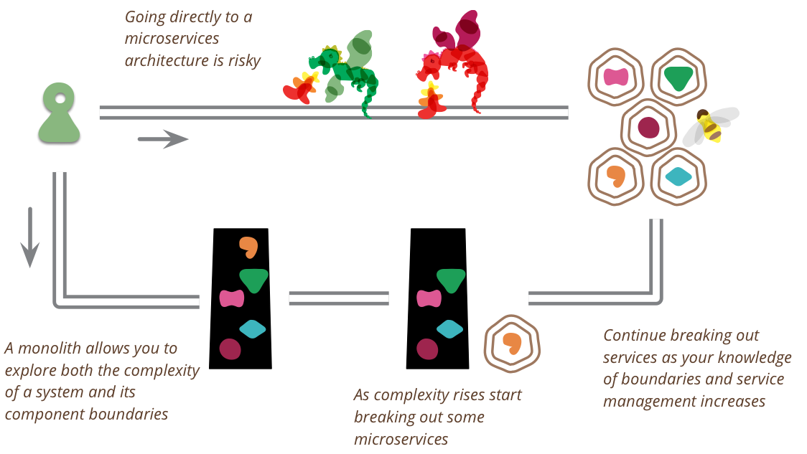

# [MonolithFirst](https://martinfowler.com/bliki/MonolithFirst.html)

2015年6月3日

[马丁·福勒](https://martinfowler.com/)

当我听到有关使用[微服务架构的](https://martinfowler.com/articles/microservices.html)团队的故事时，我注意到了一种常见的模式。

1. **几乎所有成功的微服务故事，都始于一个庞大的整体并且被分解了**。
2. **几乎所有我听说过的一开始就构建为微服务的系统，最终都遇到了严重的麻烦**。

这种模式使我的许多同事争辩说**，即使您确定您的应用程序足够大也值得这样做，但您不应该使用微服务启动新项目。** 

微服务是一种有用的体系结构，但是甚至他们的拥护者都说使用微服务会产生大量的 [MicroservicePremium](https://martinfowler.com/bliki/MicroservicePremium.html)，这意味着它们仅在更复杂的系统中有用。这种溢价，实质上是管理一套服务的成本，将减慢团队的速度，为更简单的应用提供整体支持。这导致了一种以整体优先为先的策略的有力论据，在该策略中，即使您认为稍后可能会从微服务架构中受益，也应该将新应用程序最初构建为整体。

第一个原因是经典的[Yagni](https://martinfowler.com/bliki/Yagni.html)。当您开始一个新的应用程序时，您如何确定它将对您的用户有用？扩展一个设计不佳但成功的软件系统可能很困难，但是与逆向运算相比，这仍然是一个更好的选择。正如我们现在所认识到的那样，通常找出软件想法是否有用的最佳方法是构建一个简单的版本并查看其效果如何。在第一个阶段中，您需要优先考虑速度（从而优先考虑反馈的周期时间），因此，微服务的优缺点是您不应该遇到的麻烦。

从微服务开始的第二个问题是，只有当您在服务之间找到良好，稳定的边界时，微服务才能很好地工作-本质上这是绘制正确的[BoundedContexts](https://martinfowler.com/bliki/BoundedContext.html)集合的[任务](https://martinfowler.com/bliki/BoundedContext.html)。服务之间功能的任何重构都比整体中难得多。但是，即使是在熟悉领域工作的经验丰富的建筑师也很难在一开始就正确确定界限。通过首先构建一个整体，您可以找出正确的边界，然后再将微服务设计刷在它们上面。它还使您有时间开发更细粒度的服务所需的 [MicroservicePrerequisites](https://martinfowler.com/bliki/MicroservicePrerequisites.html)。

我听说过执行整体优先策略的不同方法。合理的方法是精心设计一个整体，同时注意软件在API边界和数据存储方式上的模块化。做到这一点，向微服务转变是一个相对简单的事情。但是，如果我听过很多这样的故事，我会对这种方法感到更自在。[[1\]](https://martinfowler.com/bliki/MonolithFirst.html#footnote-typical-monolith)

一种更常见的方法是从整体开始，然后逐渐剥离边缘的微服务。这样的方法可以在微服务体系结构的核心中保留大量的整体组件，但是随着整体组件相对静止，大多数新的开发都发生在微服务中。

另一种常见的方法是完全替换整体。很少有人认为这是值得骄傲的方法，但是将整体构建为[SacrificialArchitecture](https://martinfowler.com/bliki/SacrificialArchitecture.html)有很多优势 。不要害怕构建将要丢弃的整体，特别是如果整体可以快速将您推向市场。

我遇到的另一种方法是从仅几个粗粒度的服务开始，这些服务要比您最终期望的要大。使用这些粗粒度的服务来习惯于使用多个服务，同时享受这样的事实：这种粗粒度会减少您必须做的服务间重构量。然后，随着边界的稳定，分解为更细粒度的服务。[[2\]](https://martinfowler.com/bliki/MonolithFirst.html#footnote-duolith)

虽然我的大部分联络人都倾向于采用“整体优先”的方法，但这[绝不是一致的](https://martinfowler.com/articles/dont-start-monolith.html)。相反的说法是，从微服务开始，您可以习惯于在微服务环境中进行开发的节奏。要以足够模块化的方式构建整体，以便将其轻松分解为微服务，需要花费很多甚至太多的纪律。通过开始使用微服务，您可以使每个人从一开始就习惯于在单独的小型团队中进行开发，而使团队按服务边界分开，则可以在需要时更轻松地扩大开发工作量。这对于系统更换特别可行，在系统更换中，您更有可能尽早提出足够稳定的界限。尽管证据很少，但我认为除非您有在团队中构建微服务系统的合理经验，否则您不应该从微服务入手。

我觉得我还没有足够的轶事来决定如何使用整体优先的策略。这些是微服务中的早期事物，可以学习的轶事相对较少。因此，关于这些主题的任何人的建议都必须被视为是尝试性的，无论他们有多自信。

## 进一步阅读

Sam Newman[描述了](http://samnewman.io/blog/2015/04/07/microservices-for-greenfield/)一个团队[的案例研究](http://samnewman.io/blog/2015/04/07/microservices-for-greenfield/)，该团队考虑在未开发项目上使用微服务。

## 笔记

**1：** 您不能假设可以采用任意系统并将其分解为微服务。大多数系统在其模块之间获取了太多的依赖关系，因此无法明智地分解。我听说过很多情况下，试图分解整体的结果很快变得一团糟。我也听说过一些成功的逐步实现微服务的方法-但是这些情况需要从相对良好的模块化设计开始。

**2：** 我想严格来说您应该将其称为“双核”，但我认为该方法遵循“单核优先”策略的本质：从粗粒度开始以获取知识，然后进行拆分。

## 致谢

我从我的同事们那里窃取了很多想法：詹姆斯·刘易斯，萨姆·纽曼，蒂亚古·帕拉尼萨米和埃文·鲍彻。斯蒂芬·蒂尔科夫（Stefan Tilkov）对较早草案的评论在澄清我的想法方面起着关键作用。乍得·柯里（Chad Currie）创造了可爱的雕龙。Steven Lowe，Patrick Kua，Jean Robert D'amore，Chelsea Komlo，Ashok Subramanian，Dan Siwiec，Prasanna Pendse，Kief Morris，Chris Ford和Florian Sellmayr讨论了我们内部邮件列表中的草案。

原文：https://martinfowler.com/bliki/MonolithFirst.html